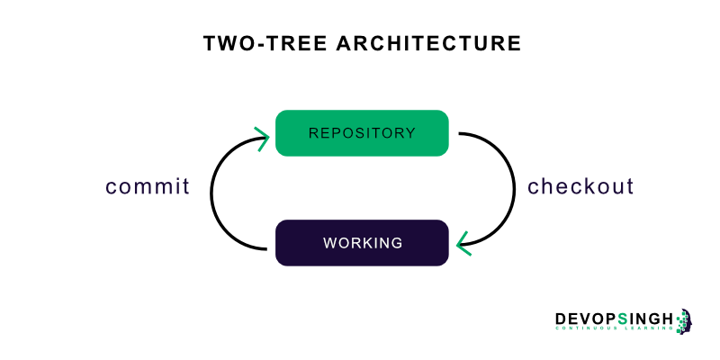

footer: © Epignosis LLC
slidenumbers: true
autoscale: true

> ABCDEF GIT
-- An in depth intro to GIT

---

# Agenda

- What is not GIT
- What is GIT
- Getting started
- Git concepts and architecture
- Making changes to files


---

# Agenda

- Undoing changes
- Ignoring files
- Navigating the commit tree
- Branching
- Merging Branches

---

# Agenda

- Stashing
- Remotes
- Tips and tricks
- Resources

---

# What GIT is __**not**__

---

### 1. Git is not Subversion with some added sugar sprinkled in

---

### 2. Git is not expensive network or space wise

---

### 3. Git is not just for hackers or those who fly on airplanes all day to conferences

---

### 4. Git is not hard to set up

---

### 5. Git is not hard to learn

---

### 6. Git is not complex

---

## So...

---

#What __**is**__ GIT?

---

### Git is a VCS 

---

### a.k.a Version Control System

---

### Git is a VCS
- Git keeps track of changes, especially text changes

---

### Git is a VCS
- Git keeps track of changes, especially text changes
- version 1, version 2, version 3

---

### Git is a VCS
- Git keeps track of changes, especially text changes
- version 1, version 2, version 3
- compare versions

---

### Git is a VCS
- Git keeps track of changes, especially text changes
- version 1, version 2, version 3
- compare versions
- see what changed in each version

---

## Git is a __**distributed**__ VCS

---

## Git is a __**distributed**__ VCS

- No central place to store the copy of your project is needed

---

## Git is a __**distributed**__ VCS

- No central place to store the copy of your project is needed
- Different users (or teams) maintain their own repositories

---

## Git is a __**distributed**__ VCS

- No central place to store the copy of your project is needed
- Different users (or teams) maintain their own repositories
- No network connection needed

---

## Git is a __**distributed**__ VCS

- No central place to store the copy of your project is needed
- Different users (or teams) maintain their own repositories
- No network connection needed
- faster

---


---

# Getting Started

---

#Initializing a git repository

`cd /path/to/your/existing/code`
`git init`

---

## git init 

- Creates a new empty git repository

---

## git init 

- Creates a new empty git repository
- You have an entire repository into your directory

---

## git init 

- Creates a new empty git repository
- You have an entire repository into your directory
- Git does not necessarily need a server to use

---

# Hey!

---

### Where are my changes stored?


---

### Cool, huh?


---

## Performing our first commit

---

# Performing our first commit

```
cd /path/to/project
echo "This is a line of code" >> kati.txt 
git add kati.txt 
git commit -m "added kati.txt to the repo"

```
---

# Adding changes to the staging area

`git add /path/to/file`
`git add .`
`git add -A`
`git add -Af`
`git add -p /path/to/file`

---

## git add

- Add writes to the repository (in a binary object)
- Add is used to add changes to the staging area

---
# Viewing the differences

`git diff HEAD`
`git diff`
`git diff --staged `
`git diff -w`
`git diff --ignore-all-space`

---
# Committing to the repo 

`git commit`
`git commit -m "<message>"`
`git commit -a`
`git commit -am "<message>"`

---

## git commit

- Commit takes what has been written in the repo and creates a commit object for that
- The commit object has an id (hash)
- The commit object has labels on it (head, master)
- Snapshots, not differences are saved

---

# Viewing the commit log

`git log`
`git log -n <number>`
`git log --since=<date>`
`git log --until=<date>`

---

## git log

- Commit Hash
- Author 
- Date
- Commit message

---

## Show current status of the repo

`git status`
`git status -s`
`git status -sb`


---

## git status

- Shows changes in working directory
- Shows changes in the staging area
- It is clean when every change is committed

---

# Happy, so far?


---

# Git Concepts and Architecture

---



---


---

## Why staging __**rocks?**__


---

### You can control to commit __**part**__ of the changes

---

### It helps you sneak in __**small**__ changes

---

### It helps you __**split**__ a large change into multiple commits

---

### It helps you __**review**__ your changes


---

## The git workflow

---

### The git workflow

1. Create new file kati
2. Git add  & commit new file kati(A)
3. Make changes to kati 
4. Git add & commit kati (B)

---

> Repeat until the world ends

---

## Working with the __**HEAD**__ pointer

---

> Finally figuring out that git commands are strangely named graph manipulation commands -- creating/deleting nodes, moving pointers around
--Kent Beck

---

### HEAD points to the __**latest change**__ in the repository

---

### __**Remember**__

---

### HEAD points to the __**repo**__, not the staging area, or the working directory!

---

### HEAD points to the __**last state**__ of our repo, what was last checked out

---

### Every time we commit a change, HEAD __**moves**__ to this latest change

---

### Aren't pointers just __**awesome**__?

---


---


